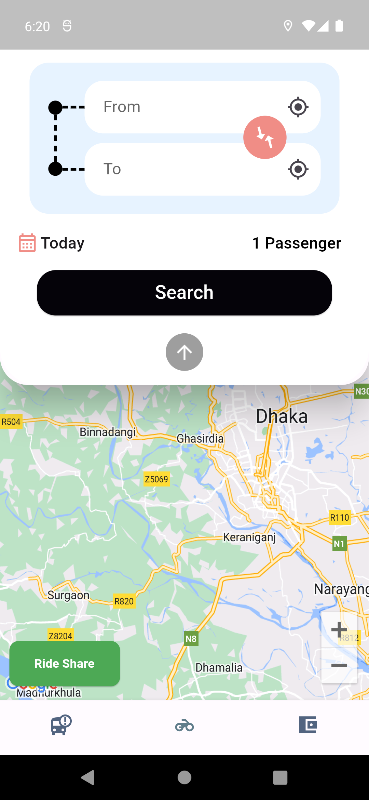
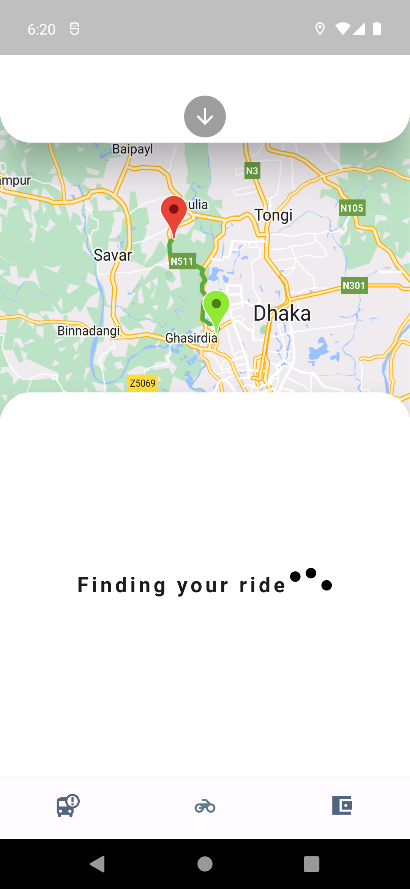
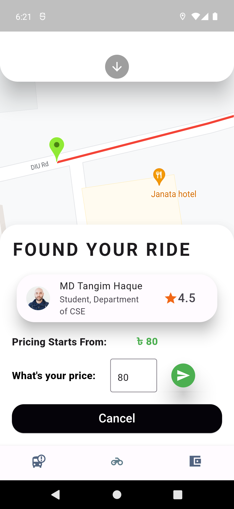
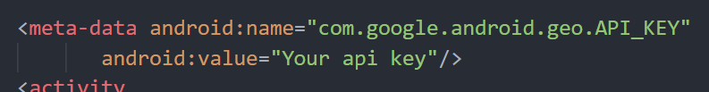

<h1 align="center" id="title">Chature - A simple Text Base app</h1>

Introducing DIU Rider – Your Trusty Companion for Hassle-Free Rides!

🚗📱

DIU Rider is your go-to ride-sharing app for smooth and convenient travel. With our user-friendly interface, real-time navigation powered by Google Maps, and a commitment to your safety, we're here to make every journey an effortless experience. Download DIU Rider today and discover the ultimate way to get around town.

<h2>Project Screenshots:</h2>

   

<h2>🚀 Demo</h2>

[Watch the Video](https://youtu.be/vuGF1sW_yiI)

<h2>🧐 Features</h2

Here're some of the project's best features:

- Firebase Authetication
- Firebase Firestore
- Google Map Api

<h2>🐱‍🚀 Set your google map api key to AndroidManifest.xml</h2>

<h2>💻 Built with</h2>

Technologies used in the project:

- Firebase
- Firestore
- Flutter
- Google Map Api

<h2>💖Like my work?</h2>

Contact with me (Telegram) <a href="https://t.me/tangim4103">Tangim Haque</a>  
Email <a href="mailto:tangim15-4103@diu.edu.bd">tangim15-4103@diu.edu.bd</a>
